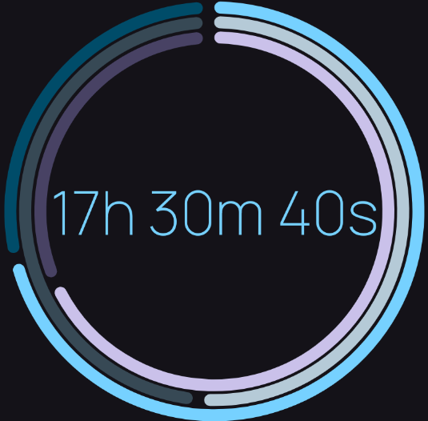

# CircularDurationView

A custom view for Android that displays a duration in a circular fashion.

[](https://jitpack.io/#abdalmoniem/CircularDurationView)

## Screenshot



## Features

- Displays a duration in a circular format.
- The duration can be in seconds, minutes or hours.
- The progress indicators can be animated or not.
- The view is divided into three parts: hours, minutes and seconds.
- For each part, a progress indicator is displayed to show the progress of that part of the duration.
- A text view is displayed at the center of the view to show the duration in a readable format.

## Attributes

- [ ] Incomplete task
- [x] Completed task

| Attribute / Property              | Type      | Description                                                | Default Value             | in XML |
|-----------------------------------|-----------|------------------------------------------------------------|---------------------------|--------|
| indicatorSize                     | dimension | The size of the progress indicators.                       | undefined                 | yes    |
| indicatorsGapSize                 | dimension | The gap size between the progress indicators.              | 5dp                       | yes    |
| indicatorsColor                   | color     | The color of the progress indicators.                      | colorPrimary              | yes    |
| indicatorsTrackColor              | color     | The color of the track of the progress indicators.         | colorPrimary              | yes    |
| indicatorsTrackGapSize            | dimension | The gap size between the track of the progress indicators. | 10dp                      | yes    |
| indicatorsTrackThickness          | dimension | The thickness of the track of the progress indicators.     | 15dp                      | yes    |
| indicatorsTrackCornerRadius       | dimension | The corner radius of the track of the progress indicators. | 10dp                      | yes    |
| animated                          | boolean   | Whether the progress indicators are animated or not.       | true                      | yes    |
| hoursIndicatorMax                 | integer   | The maximum value of the hours indicator.                  | 24                        | yes    |
| hoursIndicatorProgress            | integer   | The progress of the hours indicator.                       | 0                         | yes    |
| hoursIndicatorColor               | color     | The color of the hours indicator.                          | colorPrimary              | yes    |
| hoursIndicatorTrackColor          | color     | The color of the track of the hours indicator.             | colorPrimary              | yes    |
| hoursIndicatorTrackGapSize        | dimension | The gap size between the track of the hours indicator.     | undefined                 | yes    |
| hoursIndicatorTrackThickness      | dimension | The thickness of the track of the hours indicator.         | undefined                 | yes    |
| hoursIndicatorTrackCornerRadius   | dimension | The corner radius of the track of the hours indicator.     | undefined                 | yes    |
| minutesIndicatorProgress          | integer   | The progress of the minutes indicator.                     | 0                         | yes    |
| minutesIndicatorColor             | color     | The color of the minutes indicator.                        | colorPrimary              | yes    |
| minutesIndicatorTrackColor        | color     | The color of the track of the minutes indicator.           | colorPrimary              | yes    |
| minutesIndicatorTrackGapSize      | dimension | The gap size between the track of the minutes indicator.   | undefined                 | yes    |
| minutesIndicatorTrackThickness    | dimension | The thickness of the track of the minutes indicator.       | undefined                 | yes    |
| minutesIndicatorTrackCornerRadius | dimension | The corner radius of the track of the minutes indicator.   | undefined                 | yes    |
| secondsIndicatorProgress          | integer   | The progress of the seconds indicator.                     | 0                         | yes    |
| secondsIndicatorColor             | color     | The color of the seconds indicator.                        | colorPrimary              | yes    |
| secondsIndicatorTrackColor        | color     | The color of the track of the seconds indicator.           | colorPrimary              | yes    |
| secondsIndicatorTrackGapSize      | dimension | The gap size between the track of the seconds indicator.   | undefined                 | yes    |
| secondsIndicatorTrackThickness    | dimension | The thickness of the track of the seconds indicator.       | undefined                 | yes    |
| secondsIndicatorTrackCornerRadius | dimension | The corner radius of the track of the seconds indicator.   | undefined                 | yes    |
| text                              | string    | The text to be displayed at the center of the view.        | undefined                 | yes    |
| progress                          | Duration  | The progress of the duration.                              | hours + minutes + seconds | **no** |
| textColor                         | color     | The color of the text.                                     | colorPrimary              | yes    |
| textStyle                         | flags     | The style of the text.                                     | normal                    | yes    |
| textAlign                         | enum      | The alignment of the text.                                 | center                    | yes    |
| textPadding                       | dimension | The padding of the text.                                   | 0dp                       | yes    |
| textFontFamily                    | reference | The font family of the text.                               | undefined                 | yes    |

## Usage

Add the following dependency to your module `build.gradle` file:

### Gradle

```gradle
dependencies {
    implementation 'com.github.abdalmoniem:CircularDurationView:1.0.0'
}
```

### Kotlin DSL

```kotlin
dependencies {
    implementation("com.github.abdalmoniem:CircularDurationView:1.0.0")
}
```

### Using Version Catalog

Add the following dependency to your module `libs.versions.toml` file:

```toml
[versions]
circulardurationview = "1.0.0"

[libraries]
circulardurationview = { module = "com.github.abdalmoniem:CircularDurationView", version.ref = "circulardurationview" }
```

Add the following dependency to your module `build.gradle.kts` file:

```kotlin
dependencies {
    implementation(libs.circulardurationview)
}
```

### XML layout

```xml
<com.hifnawy.circulardurationview.CircularDurationView
    android:id="@+id/progressIndicator"
    android:layout_width="wrap_content"
    android:layout_height="wrap_content"
    android:padding="20dp"
    app:hoursIndicatorColor="?colorPrimary"
    app:hoursIndicatorMax="24"
    app:hoursIndicatorProgress="7"
    app:hoursIndicatorTrackColor="?colorPrimaryContainer"
    app:indicatorSize="350dp"
    app:indicatorsGapSize="5dp"
    app:indicatorsTrackCornerRadius="30dp"
    app:indicatorsTrackGapSize="10dp"
    app:indicatorsTrackThickness="10dp"
    app:layout_constraintBottom_toTopOf="@+id/settingsCardTitle"
    app:layout_constraintEnd_toEndOf="parent"
    app:layout_constraintStart_toStartOf="parent"
    app:layout_constraintTop_toTopOf="parent"
    app:layout_constraintVertical_weight="2"
    app:minutesIndicatorColor="?colorSecondary"
    app:minutesIndicatorProgress="30"
    app:minutesIndicatorTrackColor="?colorSecondaryContainer"
    app:secondsIndicatorColor="?colorTertiary"
    app:secondsIndicatorProgress="40"
    app:secondsIndicatorTrackColor="?colorTertiaryContainer"
    app:textAlign="center"
    app:textColor="?colorPrimary"
    app:textFontFamily="@font/manrope"
    app:textPadding="5dp"
    app:textStyle="normal" />
```

### From Code

```kotlin
val progressIndicator = findViewById<CircularDurationView>(R.id.progressIndicator)
progressIndicator.hoursIndicatorProgress = 7
progressIndicator.minutesIndicatorProgress = 30
progressIndicator.secondsIndicatorProgress = 40
progressIndicator.text = "00:00:00"
progressIndicator.progress = 100.minutes
...
```
