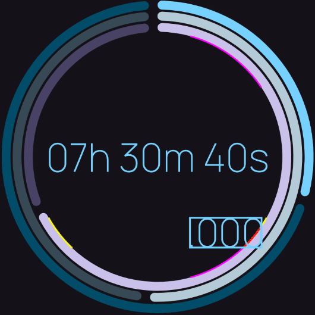

<!--suppress CheckImageSize, HtmlDeprecatedAttribute -->

<div align=center>
    <h1>CircularDurationView</h1>
    <p>A custom view for Android that displays a duration in a circular fashion.</p>

[](https://jitpack.io/#abdalmoniem/CircularDurationView)
[](https://img.shields.io/badge/License-GPL%20v3-yellow.svg)
[](https://github.com/abdalmoniem/CircularDurationView/actions/workflows/build_debug_variant.yml)
[](https://github.com/abdalmoniem/CircularDurationView/actions/workflows/build_release_variant.yml)
[](https://github.com/abdalmoniem/CircularDurationView/actions/workflows/publish_release_on_tag.yml)
[](https://www.codefactor.io/repository/github/abdalmoniem/CircularDurationView)
[](https://app.codacy.com/gh/abdalmoniem/CircularDurationView)
[](https://github.com/abdalmoniem/CircularDurationView)
[](https://github.com/abdalmoniem/CircularDurationView/releases/latest)
</div>

## Screenshots

<table>
    <tr>
        <td>
            
        </td>
        <td>
            
        </td>
    </tr>
</table>

## Features

- Displays a duration in a circular format.
- The duration can be in seconds, minutes or hours.
- The progress indicators can be animated or not.
- The view is divided into three parts: hours, minutes and seconds.
- For each part, a progress indicator is displayed to show the progress of that part of the duration.
- A text view is displayed at the center of the view to show the duration in a readable format.

## Attributes

| Attribute / Property              | Type      | Description                                                                               | Default Value                                     | in XML   |
|-----------------------------------|-----------|-------------------------------------------------------------------------------------------|---------------------------------------------------|----------|
| indicatorSize                     | dimension | The size of the progress indicators.                                                      | undefined                                         | yes      |
| indicatorsGapSize                 | dimension | The gap size between the progress indicators.                                             | 5dp                                               | yes      |
| indicatorsColor                   | color     | The color of the progress indicators.                                                     | colorPrimary                                      | yes      |
| indicatorsTrackColor              | color     | The color of the track of the progress indicators.                                        | colorPrimary                                      | yes      |
| indicatorsTrackGapSize            | dimension | The gap size between the track of the progress indicators.                                | 10dp                                              | yes      |
| indicatorsTrackThickness          | dimension | The thickness of the track of the progress indicators.                                    | 15dp                                              | yes      |
| indicatorsTrackCornerRadius       | dimension | The corner radius of the track of the progress indicators.                                | 10dp                                              | yes      |
| staggeredInfiniteAnimationDelay   | integer   | The delay between the animations of the progress indicators when the duration is infinite | 50ms                                              | yes      |
| animated                          | boolean   | Whether the progress indicators are animated or not.                                      | true                                              | yes      |
| hoursIndicatorMax                 | integer   | The maximum value of the hours indicator.                                                 | 24                                                | yes      |
| hoursIndicatorProgress            | integer   | The progress of the hours indicator.                                                      | 0                                                 | yes      |
| hoursIndicatorColor               | color     | The color of the hours indicator.                                                         | colorPrimary                                      | yes      |
| hoursIndicatorTrackColor          | color     | The color of the track of the hours indicator.                                            | colorPrimary                                      | yes      |
| hoursIndicatorTrackGapSize        | dimension | The gap size between the track of the hours indicator.                                    | undefined                                         | yes      |
| hoursIndicatorTrackThickness      | dimension | The thickness of the track of the hours indicator.                                        | undefined                                         | yes      |
| hoursIndicatorTrackCornerRadius   | dimension | The corner radius of the track of the hours indicator.                                    | undefined                                         | yes      |
| minutesIndicatorProgress          | integer   | The progress of the minutes indicator.                                                    | 0                                                 | yes      |
| minutesIndicatorColor             | color     | The color of the minutes indicator.                                                       | colorPrimary                                      | yes      |
| minutesIndicatorTrackColor        | color     | The color of the track of the minutes indicator.                                          | colorPrimary                                      | yes      |
| minutesIndicatorTrackGapSize      | dimension | The gap size between the track of the minutes indicator.                                  | undefined                                         | yes      |
| minutesIndicatorTrackThickness    | dimension | The thickness of the track of the minutes indicator.                                      | undefined                                         | yes      |
| minutesIndicatorTrackCornerRadius | dimension | The corner radius of the track of the minutes indicator.                                  | undefined                                         | yes      |
| secondsIndicatorProgress          | integer   | The progress of the seconds indicator.                                                    | 0                                                 | yes      |
| secondsIndicatorColor             | color     | The color of the seconds indicator.                                                       | colorPrimary                                      | yes      |
| secondsIndicatorTrackColor        | color     | The color of the track of the seconds indicator.                                          | colorPrimary                                      | yes      |
| secondsIndicatorTrackGapSize      | dimension | The gap size between the track of the seconds indicator.                                  | undefined                                         | yes      |
| secondsIndicatorTrackThickness    | dimension | The thickness of the track of the seconds indicator.                                      | undefined                                         | yes      |
| secondsIndicatorTrackCornerRadius | dimension | The corner radius of the track of the seconds indicator.                                  | undefined                                         | yes      |
| text                              | string    | The text to be displayed at the center of the view.                                       | undefined                                         | yes      |
| progress                          | Duration  | The progress of the duration.                                                             | hoursProgress + minutesProgress + secondsProgress | __*no*__ |
| textColor                         | color     | The color of the text.                                                                    | colorPrimary                                      | yes      |
| textStyle                         | flags     | The style of the text.                                                                    | normal                                            | yes      |
| textAlign                         | enum      | The alignment of the text.                                                                | center                                            | yes      |
| textPadding                       | dimension | The padding of the text.                                                                  | 0dp                                               | yes      |
| textFontFamily                    | reference | The font family of the text.                                                              | undefined                                         | yes      |
| showSubText                       | boolean   | Whether to show the sub text or not. This shows the sub-second value of the duration      | false                                             | yes      |
| subTextPadding                    | dimension | The padding of the sub text.                                                              | 5dp                                               | yes      |

## Usage

Add the following dependency to your module `build.gradle` file:

### Gradle

```gradle
dependencies {
    implementation 'com.github.abdalmoniem:CircularDurationView:1.1.1'
}
```

### Kotlin DSL

```kotlin
dependencies {
    implementation("com.github.abdalmoniem:CircularDurationView:1.1.1")
}
```

### Using Version Catalog

Add the following dependency to your module `libs.versions.toml` file:

```toml
[versions]
circulardurationview = "1.1.1"

[libraries]
circulardurationview = { module = "com.github.abdalmoniem:CircularDurationView", version.ref = "circulardurationview" }
```

Add the following dependency to your module `build.gradle.kts` file:

```kotlin
dependencies {
    implementation(libs.circulardurationview)
}
```

### XML layout

```xml

<com.hifnawy.circulardurationview.CircularDurationView
    android:id="@+id/progressIndicator"
    android:layout_height="wrap_content"
    android:layout_width="wrap_content"
    android:padding="20dp"
    app:hoursIndicatorColor="?colorPrimary"
    app:hoursIndicatorMax="24"
    app:hoursIndicatorProgress="7"
    app:hoursIndicatorTrackColor="?colorPrimaryContainer"
    app:indicatorSize="350dp"
    app:indicatorsGapSize="5dp"
    app:indicatorsTrackCornerRadius="30dp"
    app:indicatorsTrackGapSize="10dp"
    app:indicatorsTrackThickness="10dp"
    app:layout_constraintBottom_toTopOf="@+id/settingsCardTitle"
    app:layout_constraintEnd_toEndOf="parent"
    app:layout_constraintStart_toStartOf="parent"
    app:layout_constraintTop_toTopOf="parent"
    app:layout_constraintVertical_weight="2"
    app:minutesIndicatorColor="?colorSecondary"
    app:minutesIndicatorProgress="30"
    app:minutesIndicatorTrackColor="?colorSecondaryContainer"
    app:secondsIndicatorColor="?colorTertiary"
    app:secondsIndicatorProgress="40"
    app:secondsIndicatorTrackColor="?colorTertiaryContainer"
    app:textAlign="center"
    app:textColor="?colorPrimary"
    app:textFontFamily="@font/manrope"
    app:textPadding="5dp"
    app:textStyle="normal" />
```

### From Code

```kotlin
val progressIndicator = findViewById<CircularDurationView>(R.id.progressIndicator)
progressIndicator.hoursIndicatorProgress = 7
progressIndicator.minutesIndicatorProgress = 30
progressIndicator.secondsIndicatorProgress = 40
progressIndicator.text = "00:00:00"
progressIndicator.progress = 100.minutes
...
```

# Note for Developers (and myself 😅)

<details>
<summary>
<h2>Box-Circle Intersection</h2>
</summary>

When I was developing the library, there was a need to calculate the intersection of the
`bounding box` of the subtext and the seconds indicator (which is a circle).

Here is what I did:

## 1. Draw the `bounding box` of the subtext on a canvas.

## 2. Draw the `bounding circle` of the seconds indicator on a canvas.

## 3. Calculate the intersection of the two bounding boxes.

Breaking it down step by step:

## 1. Draw the `bounding box` of the subtext on a canvas.

### 1. First I needed to get the `bounding box` of the subtext. Here's how:

```kotlin
private fun getTextBounds(textStr: String, textX: Float, textY: Float, textPaint: Paint): RectF = Rect().let { textBounds ->
    textPaint.getTextBounds(textStr, 0, textStr.length, textBounds)

    val left = textX - textBounds.width() * 0.5f
    val top = textY + textBounds.top
    val right = textX + textBounds.width() * 0.5f
    val bottom = textY + textBounds.bottom

    RectF(left, top, right, bottom)
}
```

## 2. Draw the `bounding circle` of the seconds indicator on a canvas.

### 1. First I needed to get the `bounding circle` of the seconds indicator. This is was very simple to

get, since the seconds indicator is a circle and it's radius is already calculated based on the
hours and minutes indicators.

```kotlin
  val secondsIndicatorRadius = mSecondsIndicator.indicatorSize * 0.5f - mSecondsIndicatorTrackThickness
```

## 3. Calculate the intersection of the two bounding boxes.

### 1. Now that I have the `bounding box` of the subtext and the `bounding circle` of the seconds

indicator, I can calculate the intersection of the two bounding boxes. By looping through all
the points of the circle and checking if they are inside the text bounds, I can get the
intersection of the `bounding box` of the subtext and the `bounding circle` of the seconds
indicator.

```kotlin
private fun isTextBoundsOutsideRadius(textBounds: RectF, circleX: Float, circleY: Float, radius: Float): Boolean {
    // Loop through all possible angles and check if any cartesian point of the circle is inside the text bounds
    val stepSize = 0.5f
    generateSequence(0f) {
        if (it + stepSize <= 360f) it + stepSize else null
    }.forEach { angle ->
        val radians = Math.toRadians(angle.toDouble())
        val x = circleX + radius * cos(radians).toFloat()
        val y = circleY + radius * sin(radians).toFloat()

        if (x <= textBounds.right && x >= textBounds.left && y >= textBounds.top && y <= textBounds.bottom) return true
    }

    return false
}
  ```

> Notice that the step size is **_`0.5f`_**, which means that I will loop through all the angles
> from **_`0`_** to **_`360`_** degrees, with a step size of **_`0.5f`_** degrees. This will give
> me **_`720`_** angles to compare with the text bounds. By comparing the cartesian coordinates of
> the circle with the text bounds, I can determine if the circle is inside the text bounds or
> outside the text bounds. Playing with the step size will determine how accurate the intersection
> is but at the cost of performance.

<div align="center">
  
</div>

Notice the `yellow` and `magenta` points, these are the cartesian coordinates of the circle that
that lie between the `top` and `bottom` of the text bounds and the `left` and `right` of the
text bounds respectively. the `red` points are the cartesian coordinates of the circle that lie
both between the `top` and `bottom` of the text bounds and the `left` and `right` of the text
bounds.

### 2. Now I can take action based on the intersection of the two bounding boxes.

```kotlin
mSubTextPaint.textSize = mTextPaint.textSize

val nanos = mProgress.toComponents { _, _, _, nanoseconds -> nanoseconds / 1_000_000 }
val subText = String.format(Locale.ENGLISH, ".%03d", nanos % 1_000)
val subTextWidth = mSubTextPaint.measureText(subText)
val subTextHeight = mSubTextPaint.textHeight
var subTextX = textX + (textWidth * 0.5f) - (subTextWidth * 0.5f) - (mSecondsIndicatorTrackThickness * 0.5f) /* - mTextPadding */
val subTextY = textY - subTextHeight + mSubTextPadding
var subTextBounds = getTextBounds(subText, subTextX, subTextY, mSubTextPaint)
val secondsIndicatorRadius = mSecondsIndicator.indicatorSize * 0.5f - mSecondsIndicatorTrackThickness

while (isTextBoundsOutsideRadius(subTextBounds, textX, textY + textHeight * 0.5f, secondsIndicatorRadius)) {
    mSubTextPaint.textSize -= 0.1f
    subTextX -= 0.1f

    subTextBounds = getTextBounds(subText, subTextX, subTextY, mSubTextPaint)
}
```

Since the subtext's size is the same as the main text to start, I need to make sure that the subtext
is inside the radius of the seconds indicator. If the subtext is outside the radius, I decrease the
size of the subtext and move it to the left until it is inside the radius.

### 3. Finally, I draw the subtext on the canvas.

</details>
